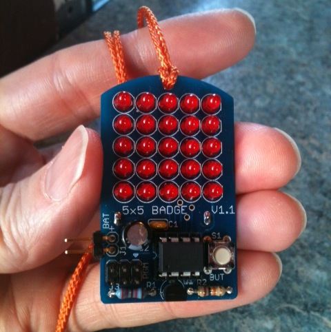

## FiveByFive Badge - a 5x5 LED badge

### Brief History
The fivebyfive badge is an electronic kit that runs on a coin battery.
It can scroll a simple text-based message across its 5x5 LED "display".

The badge was a popular soldering kit during the years 2012-2016 in various venues where we
ran soldering workshops.
A number of friends helped in these workshops, and I want to acknowledge them here:
Miloh, Jethro and Abhishek were all super helpful for many of the workshops.

In those years, we collectively taught hundreds of people how to solder,
and in the process, they also made a customizable badge.

### Programming Notes
The fivebyfive badge is based on the Atmel ATtiny85, an 8-pin microcontroller with 8k bytes of code space
and just 512 bytes of RAM.

(see Makefile for programming instructions)
